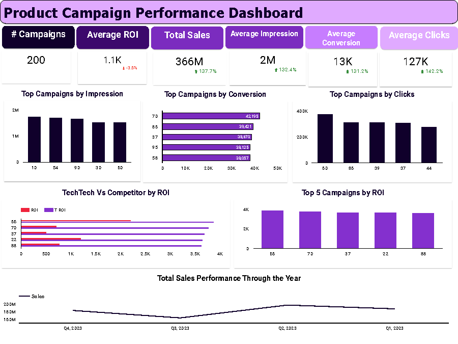
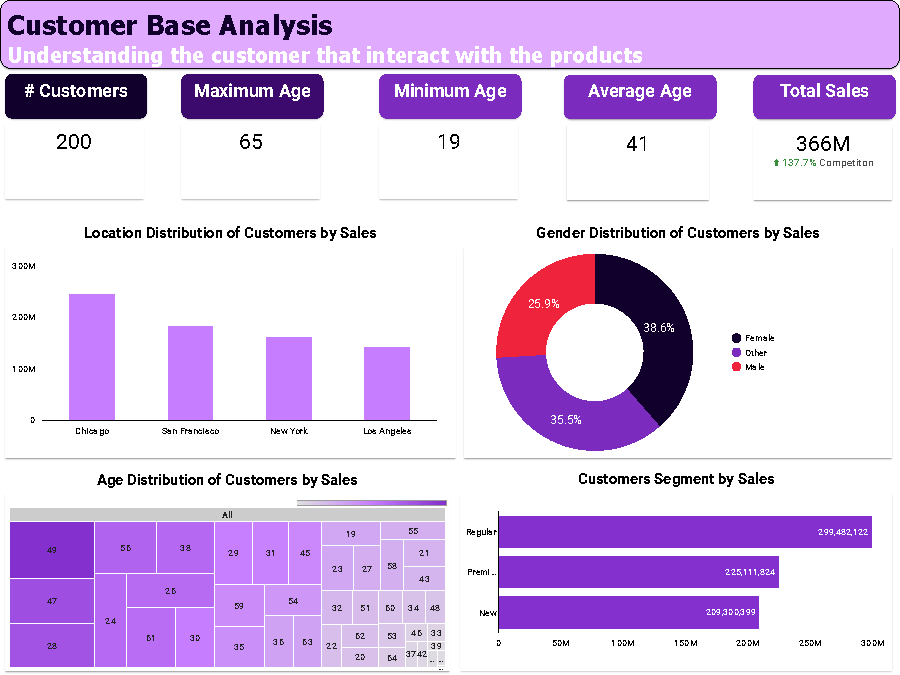
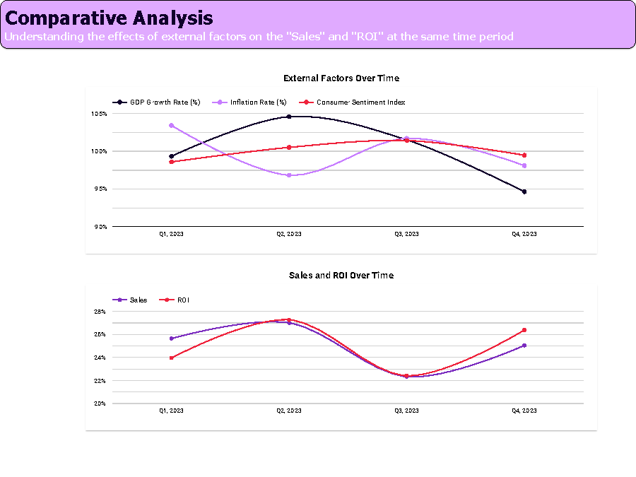

# Project Title: Product Campaign Metrics - Analyzing Marketing Campaigns against Competitors

## Project Overview

In this project, I analyzed and optimized marketing campaigns for TechTech, a company in the consumer electronics industry against it's competitor. Using Looker Studio, I conducted an in-depth analysis of marketing campaign data, focusing on key performance metrics like ROI, impressions, clicks, and customer segmentation. This project aimed to answer important business questions and provide actionable insights.

### Key Questions Answered:
1. **How do TechTech’s marketing campaigns compare against competitors?**
2. **Who are the customers, and how do different segments respond to these campaigns?**
3. **What external factors (e.g., GDP, inflation) impact sales and ROI?**
4. **What patterns are observed in the highest and lowest performing campaigns?**

---

### Tools and Technologies Used:

- **Data Analytics Tool:** Looker Studio
- **Visualization Tools:** Looker Studio Dashboards
- **Data Sources:** Internal marketing campaign data, external economic indicators

---

### Dataset Overview:
The dataset includes details on:
- Number of campaigns, impressions, clicks, conversions
- ROI and sales over time
- External economic indicators like GDP, inflation rate, and consumer sentiment index
- Customer demographics and segmentation

---

### Data Analysis Process:

#### 1. Campaign Performance Analysis
I analyzed campaign performance based on impressions, clicks, and conversions. Below is the dashboard summarizing the key insights.

- **Insight:** Variability in ROI across campaigns indicates that some campaigns performed significantly better than others. Campaign #55 showed the highest ROI but not the highest number of impressions or clicks.

---

#### 2. Customer Base Analysis
The second analysis focused on understanding the customer base, breaking them down by demographics and response to campaigns. The chart below provides insights into customer age, gender, and location distributions.

- **Insight:** The 'Regular' customer segment generated the highest sales, particularly female customers in cities like Chicago and San Francisco.

---

#### 3. External Factors and Comparative Analysis
In this section, I analyzed the influence of external factors like GDP growth and inflation on sales and ROI.

- **Insight:** Although external factors like GDP and inflation showed correlation with campaign results, they did not significantly impact the sales performance. Seasonal trends could provide a deeper understanding.

---

### Conclusion and Recommendations:

This analysis uncovered significant trends and offered actionable insights for optimizing TechTech's marketing campaigns. While our competitor showed consistent ROI results, TechTech demonstrated broader engagement, with certain campaigns excelling in impressions and conversions but not necessarily in ROI.

- **Key Insights:** The 'Regular' customer segment, particularly female customers in Chicago, generated the highest sales. Variability in ROI across campaigns highlighted opportunities to refine underperforming ones. External economic factors like GDP growth and inflation had limited impact on campaign results, but seasonal trends may play a more influential role.

---

#### Recommendations:
- **Dive deeper into seasonal trends** to understand their potential impact on campaign performance.
- **Explore optimization techniques for underperforming campaigns** to raise overall ROI.
- **Implement A/B testing** on target demographics to refine engagement strategies and improve conversion rates.
